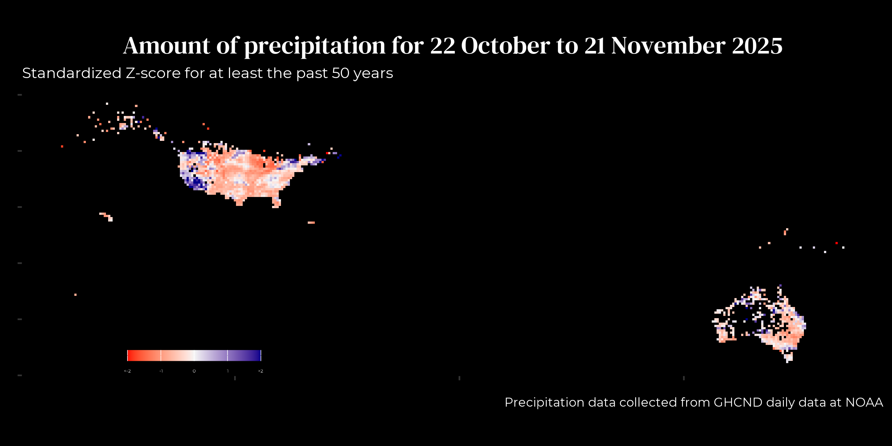

<link rel="preconnect" href="https://fonts.googleapis.com">
<link rel="preconnect" href="https://fonts.gstatic.com" crossorigin>
<link href="https://fonts.googleapis.com/css2?family=Montserrat:ital,wght@0,100..900;1,100..900&display=swap" rel="stylesheet">


```{css echo = FALSE}

.author, .title {
    display: none;
    }
.main-container{
    max-width: 100%;
}
body {
    background-color: black;
    color: white;
    font-size:1.2vw;
    font-family: "Monserrat", sans-serif;
}
```



Last update on `r lubridate::today()`  
Site [developed](`r rmarkdown::metadata$github_repo`) 
by [Elena Nuñez](mailto: `r rmarkdown::metadata$email_address`)  
